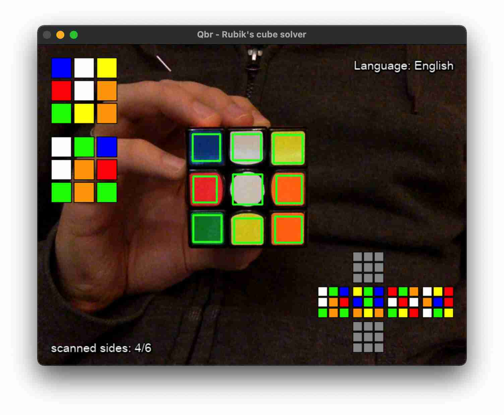

# Qbr

A rubik's cube solver written in python 3 using OpenCV via your webcam.

### Solve mode



### Calibrate mode

Isn't the default color detection not working for you? Use the **calibrate
mode** to Qbr be familiar with your cube's color scheme. If your room has proper
light then this will give you a 99% guarantee that you will get proper color
detection.

Simply follow the on-screen instructions and you're ready to go.


# Table of Contents

- [Qbr](#qbr)
    + [Solve mode](#solve-mode)
    + [Calibrate mode](#calibrate-mode)
- [Table of Contents](#table-of-contents)
- [Introduction](#introduction)
- [Installation](#installation)
- [Usage](#usage)
    + [The first 9-stickers in the upper left corner](#the-first-9-stickers-in-the-upper-left-corner)
    + [The second 9-sticker display below the one in the upper left corner](#the-second-9-sticker-display-below-the-one-in-the-upper-left-corner)
    + [Amount of sides scanned](#amount-of-sides-scanned)
    + [Calibrate mode](#calibrate-mode-1)
- [Getting the solution](#getting-the-solution)
- [Keybindings](#keybindings)
- [Paramaters](#paramaters)
- [Example runs](#example-runs)
- [Inspirational sources](#inspirational-sources)
- [License](#license)

# Introduction

The idea to create this came personally to mind when I started solving rubik's
cubes. My personal record is 7.90 seconds, but there were already so many
professional programmers around the world who created robots that solve a
rubik's cube in an ETA of 5 seconds and since 2016 in 1 second
([link](https://www.youtube.com/watch?v=ixTddQQ2Hs4)).
That inspired me to create my own. I started using images only and eventually switched to webcam.

# Installation

```
$ git clone https://github.com/kkoomen/qbr.git
$ cd qbr
$ python3 -m venv env
$ source ./env/bin/activate
$ pip3 install -r requirements.txt
```

# Usage

Run Qbr:

```
$ ./src/qbr.py
```

This opens a webcam interface where you see basically the above photo.

There are a few things you have to know:

### The first 9-stickers in the upper left corner

This is preview mode. These will update immediately and display how Qbr has
detected the colors.

### The second 9-sticker display below the one in the upper left corner

This is a snapshot state. When pressing `SPACE` it will create a snapshot in
order to show you what state it has saved. You can press `SPACE` as many times
as you'd like if it has been detected wrong.

### Amount of sides scanned

In the bottom left corner is shown the amount of sides scanned. This is so you
know if you've scanned in all sides before pressing `ESC`.

### Calibrate mode

The default color scheme are the most prominent colors for white, yellow, red,
orange, blue and green. If this can't detect your cube its colors properly then
you can use calibrate mode.

Press `c` to go into calibrate mode in order to let Qbr be familiar with your
cube's color scheme. Simply follow the on-screen instructions and you're ready
to go.

Tip: If you've scanned wrong, simple go out of calibrate mode by pressing `c`
and go back into calibrate by pressing `c` again.

# Getting the solution

Qbr checks if you have filled in all 6 sides when pressing `ESC`. If so, it'll
calculate a solution if you've scanned it correctly.

You should now see a solution (or an error if you did it wrong).

# Keybindings

- `SPACE` for saving the current state

- `ESC` quit

- `c` toggle calibrate mode

# Paramaters

You can use `-n` or `--normalize` to also output the solution in a "human-readable" format.

For example:

* `R` will be: `Turn the right side a quarter turn away from you.`
* `F2` will be: `Turn the front face 180 degrees.`

You can also specify a language by passing in `-l` or `--language`. Default language
is set to `en`.

Available languages are:

| language | key  |
| ---      | ---  |
| English  | `en` |
| Dutch    | `nl` |

# Example runs

```
$ ./qbr.py
Starting position:
front: green
top: white

Moves: 20
Solution: U2 R D2 L2 F2 L U2 L F' U L U R2 B2 U' F2 D2 R2 D2 R2
```

```
$ ./qbr.py -n
Starting position:
front: green
top: white

Moves: 20
Solution: B2 U2 F' R U D' L' B' U L F U F2 R2 F2 D' F2 D R2 D2

1. Turn the back side 180 degrees.
2. Turn the top layer 180 degrees.
3. Turn the front side a quarter turn to the left.
4. Turn the right side a quarter turn away from you.
5. Turn the top layer a quarter turn to the left.
6. Turn the bottom layer a quarter turn to the left.
7. Turn the left side a quarter turn away from you.
8. Turn the back side a quarter turn to the right.
9. Turn the top layer a quarter turn to the left.
10. Turn the left side a quarter turn towards you.
11. Turn the front side a quarter turn to the right.
12. Turn the top layer a quarter turn to the left.
13. Turn the front side 180 degrees.
14. Turn the right side 180 degrees.
15. Turn the front side 180 degrees.
16. Turn the bottom layer a quarter turn to the left.
17. Turn the front side 180 degrees.
18. Turn the bottom layer a quarter turn to the right.
19. Turn the right side 180 degrees.
20. Turn the bottom layer 180 degrees.
```

# Inspirational sources

Special thanks to [HaginCodes](https://github.com/HaginCodes) for the main
inspiration on how to improve my color detection.

https://github.com/HaginCodes/3x3x3-Rubiks-Cube-Solver

http://programmablebrick.blogspot.com/2017/02/rubiks-cube-tracker-using-opencv.html

https://gist.github.com/flyboy74/2cc3097f784c8c236a1a85278f08cddd

https://github.com/dwalton76/rubiks-color-resolver

# License

Qbr is licensed under the MIT License.
